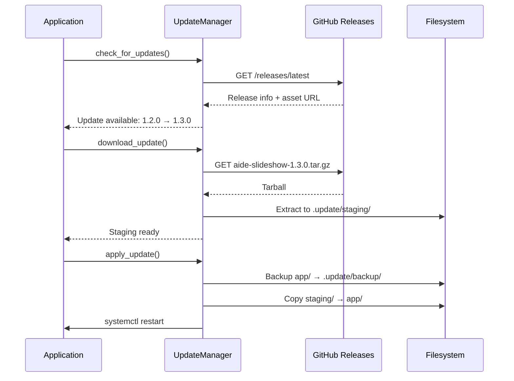

# Framework-Application Architecture

aide-frame is designed as a reusable framework that can be used across multiple applications. This document describes the architecture and mechanisms for separating framework and application.

## Basic Concept

```
aide-examples/
├── aide-frame/                 # Framework repository (monorepo)
│   ├── spec/                   # Language-independent specification
│   └── python/
│       └── aide_frame/         # Python implementation
│
├── aide-slideshow/             # Application 1
│   ├── aide-frame/             # ← Git submodule (development)
│   ├── app/
│   │   ├── aide_frame/         # ← Embedded (production)
│   │   └── slideshow.py
│   └── build.sh
│
└── aide-hello/                 # Application 2
    ├── aide-frame/             # ← Git submodule
    └── app/
        └── hello.py
```

## Two Modes: Development vs. Production

### Development Mode (Git Submodule)

In development mode, aide-frame is included as a Git submodule:

```bash
# Add submodule (once)
git -c protocol.file.allow=always submodule add ../aide-frame aide-frame

# Update submodule
git submodule update --init --recursive
```

**Advantages:**
- Changes to the framework can be tested directly
- Versioning via Git commits
- Easy upgrade to new framework versions

**Import Path Setup** (at the beginning of the main file):

```python
import os
import sys

SCRIPT_DIR = os.path.dirname(os.path.abspath(__file__))
PROJECT_DIR = os.path.dirname(SCRIPT_DIR)

# Add aide-frame to Python path (for development with submodule)
AIDE_FRAME_PATH = os.path.join(PROJECT_DIR, 'aide-frame', 'python')
if os.path.isdir(AIDE_FRAME_PATH) and AIDE_FRAME_PATH not in sys.path:
    sys.path.insert(0, AIDE_FRAME_PATH)

# Now imports work:
from aide_frame import paths, log, config
```

### Production Mode (Embedded)

For deployment on a Raspberry Pi, aide_frame is embedded directly in `app/`:

```
app/
├── aide_frame/      # Copy of the framework
├── slideshow.py
└── ...
```

**Advantages:**
- No Git dependency on the target system
- Self-contained deployment as tarball
- Remote updates work without submodule handling

## Build Process

The `build.sh` script creates a deployment package:

```bash
./build.sh              # Build to deploy/
./build.sh --tarball    # Build + tarball for release
./build.sh --clean      # Clean up
```

**What happens:**
1. `app/` is copied to `deploy/app/`
2. `aide-frame/python/aide_frame/` is copied to `deploy/app/aide_frame/`
3. `__pycache__/` directories are removed
4. Optional: Tarball is created

**Tarball structure:**
```
./app/
./app/aide_frame/
./app/aide_frame/__init__.py
./app/aide_frame/config.py
./app/aide_frame/log.py
...
./app/slideshow.py
./app/VERSION
```

## Remote Update Mechanism

The update system downloads tarballs from GitHub Releases:



**Important:** The release asset must be the build tarball (with embedded aide_frame), not GitHub's automatically generated source tarball.

## Release Workflow

### 1. Bump Version

```bash
echo "1.3.1" > app/VERSION
```

### 2. Commit Changes

```bash
git add -A
git commit -m "Bump version to 1.3.1"
git push origin main
```

### 3. Create Build

```bash
./build.sh --tarball
```

Output:
```
[INFO] Version: 1.3.1
[INFO] Total size: 2.8M
[INFO] Creating tarball: aide-slideshow-1.3.1.tar.gz
[INFO] Tarball created: releases/aide-slideshow-1.3.1.tar.gz
```

### 4. Create Git Tag

```bash
git tag v1.3.1
git push origin v1.3.1
```

### 5. Create GitHub Release

1. Go to GitHub → Releases → "Create new release"
2. Select tag `v1.3.1`
3. Title: `v1.3.1 ...`
4. **Important:** Upload `releases/aide-slideshow-1.3.1.tar.gz` as an asset
   - Use "Attach binaries by dropping them here"
   - DO NOT use the body link

### 6. Verify

```bash
curl -s "https://api.github.com/repos/OWNER/REPO/releases/latest" | \
  python3 -c "import json,sys; d=json.load(sys.stdin); print('Assets:', [a['name'] for a in d['assets']])"
```

Expected output:
```
Assets: ['aide-slideshow-1.3.1.tar.gz']
```

## Configuration

The application needs a `remote_update` section in `app/config.json`:

```json
{
    "remote_update": {
        "source": {
            "repo": "owner/repo-name"
        }
    }
}
```

Optional settings:
```json
{
    "remote_update": {
        "source": {
            "repo": "owner/repo-name",
            "use_releases": true
        },
        "service_name": "slideshow",
        "auto_check": true,
        "auto_check_hours": 24
    }
}
```

## Error Handling

### Fallback to Source Tarball

If no release asset is found, the UpdateManager falls back to GitHub's source tarball. **Caution:** This does NOT contain the embedded aide_frame!

Always verify that the asset was uploaded correctly.

### Rollback

On failed update:
```python
um = UpdateManager(config)
um.rollback()  # Restores .update/backup/
```

## Best Practices

1. **Always use build tarball** - Never the source tarball from GitHub
2. **Maintain VERSION file** - Semantic versioning (MAJOR.MINOR.PATCH)
3. **Keep submodule up to date** - `git submodule update --remote`
4. **Test locally** - Verify the tarball on a test system before release
