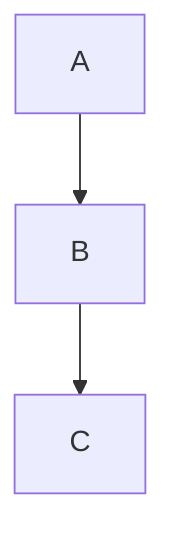

# Documentation Viewer (Python)

aide-frame includes an integrated documentation and help system with web UI.

## Overview

- `/about` - Project documentation (from `docs/` directory)
- `/help` - User help (from `help/` directory)

Both use the same unified viewer template with:
- Dynamic sidebar navigation
- Markdown rendering (marked.js)
- Mermaid diagram support
- Table of contents
- Breadcrumb navigation

## Architecture

```
┌─────────────────────────────────────────────────────────────┐
│  Browser                                                     │
│  ┌─────────────────────────────────────────────────────────┐│
│  │  viewer.html (unified template)                          ││
│  │  - Mode from URL: /help → help, /about → docs            ││
│  │  - Unified API: /api/viewer/structure?root={mode}       ││
│  │  - Unified API: /api/viewer/content?root={mode}&path=   ││
│  └─────────────────────────────────────────────────────────┘│
└─────────────────────────────────────────────────────────────┘
                              │
                              ▼
┌─────────────────────────────────────────────────────────────┐
│  aide_frame/http_routes.py                                   │
│  ├── handle_request()      → Route handling                  │
│  ├── /api/viewer/structure → get_docs_structure()           │
│  ├── /api/viewer/content   → load_file()                    │
│  ├── /api/app/config       → App configuration              │
│  └── /static/frame/*       → aide-frame assets              │
└─────────────────────────────────────────────────────────────┘
                              │
                              ▼
┌─────────────────────────────────────────────────────────────┐
│  aide_frame/docs_viewer.py                                   │
│  ├── get_docs_structure()  → Sections with titles            │
│  ├── get_structure()       → Flat file list                  │
│  ├── load_file()           → Load Markdown content           │
│  └── extract_title_and_description() → Parse metadata        │
└─────────────────────────────────────────────────────────────┘
                              │
                              ▼
┌─────────────────────────────────────────────────────────────┐
│  app/docs/                  │  app/help/                     │
│  ├── index.md               │  ├── index.md                  │
│  ├── requirements/          │  ├── getting-started.md        │
│  ├── platform/              │  └── faq.md                    │
│  ├── implementation/        │                                │
│  ├── deployment/            │                                │
│  └── development/           │                                │
└─────────────────────────────────────────────────────────────┘
```

## Unified Viewer API

A unified API for both modes (docs and help):

| Endpoint | Description |
|----------|-------------|
| `/api/viewer/structure?root=docs` | Docs structure (with sections) |
| `/api/viewer/structure?root=help` | Help structure (flat) |
| `/api/viewer/content?root=docs&path=file.md` | Docs content |
| `/api/viewer/content?root=help&path=file.md` | Help content |
| `/api/app/config` | App name, back link, features |

### Example: Structure

```bash
curl "http://localhost:8080/api/viewer/structure?root=docs"
```

```json
{
  "sections": [
    {
      "name": "Overview",
      "docs": [
        {
          "path": "index.md",
          "title": "Project Name",
          "description": "Brief description."
        }
      ]
    }
  ]
}
```

### Example: Content

```bash
curl "http://localhost:8080/api/viewer/content?root=help&path=index.md"
```

```json
{
  "content": "# Help\n\nMarkdown content...",
  "path": "index.md",
  "framework": false
}
```

## Docs vs Help

| Aspect | Docs (`/about`) | Help (`/help`) |
|--------|-----------------|----------------|
| Purpose | Technical documentation | User guide |
| Structure | Hierarchical with sections | Flat |
| Directory | `app/docs/` | `app/help/` |
| Auto-discovery | By subdirectories | All .md files |

## Section Detection (Docs)

Docs sections are automatically detected from subdirectories:

```
docs/
├── index.md              → Section "Overview"
├── requirements/         → Section "Requirements"
│   └── index.md
├── platform/             → Section "Platform"
│   └── index.md
└── implementation/       → Section "Implementation"
    └── index.md
```

Default order:
1. Overview (index.md in root)
2. Requirements
3. Platform
4. Implementation
5. Deployment
6. Development

## Title and Description

Extracted from each Markdown file:

```markdown
# My Title

This is the description (first sentence).

Further paragraphs...
```

- **Title**: First `# Heading`
- **Description**: First complete sentence after the title

## Web UI Features

### Sidebar
- Auto-generated from API
- Hover tooltips with descriptions
- Active link highlighting
- Mobile toggle

### Table of Contents
- Auto-generated from headings
- Collapsible
- Smooth scrolling

### Markdown Support
- GitHub-Flavored Markdown
- Tables, code blocks, task lists
- Syntax highlighting

### Mermaid Diagrams

````markdown

````

Loads from CDN, also works offline if available locally.

### Navigation

- **Deep links**: `/about?doc=implementation/index.md`
- **Breadcrumbs**: Shows current position
- **Link interception**: `.md` links load via JavaScript

## Assets

Images in docs/help are loaded via special asset routes:

```markdown

```

Automatically rewritten to:
- `/docs-assets/architecture.png` (for docs)
- `/help-assets/architecture.png` (for help)

## Security

Path traversal protection:
- `..` in paths is blocked
- Paths are restricted to the respective directory

## Files in aide-frame

| File | Purpose |
|------|---------|
| `http_routes.py` | Route handlers for /about, /help, APIs |
| `docs_viewer.py` | Structure parsing, file loading |
| `static/templates/viewer.html` | Unified web UI template |
| `static/css/base.css` | Base CSS for apps |
| `static/css/docs-viewer.css` | Viewer-specific CSS |
| `static/js/marked.min.js` | Markdown parser |

## Legacy APIs (Compatibility)

The old APIs are still supported:

| Legacy | New |
|--------|-----|
| `/api/docs/structure` | `/api/viewer/structure?root=docs` |
| `/api/docs/{path}` | `/api/viewer/content?root=docs&path={path}` |
| `/api/help/structure` | `/api/viewer/structure?root=help` |
| `/api/help/{path}` | `/api/viewer/content?root=help&path={path}` |

## See Also

- [HTTP Routes](http-routes.md) - DocsConfig and API details
- [Getting Started](getting-started.md) - Create a new app
