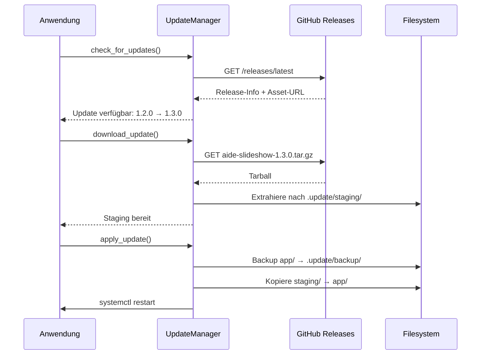

# Framework-Anwendung Architektur

aide-frame ist als wiederverwendbares Framework konzipiert, das in mehreren Anwendungen eingesetzt werden kann. Dieses Dokument beschreibt die Architektur und die Mechanismen zur Trennung von Framework und Anwendung.

## Grundkonzept

```
aide-examples/
├── aide-frame/                 # Framework-Repository (Monorepo)
│   ├── spec/                   # Sprachunabhängige Spezifikation
│   └── python/
│       └── aide_frame/         # Python-Implementierung
│
├── aide-slideshow/             # Anwendung 1
│   ├── aide-frame/             # ← Git Submodule (Entwicklung)
│   ├── app/
│   │   ├── aide_frame/         # ← Eingebettet (Produktion)
│   │   └── slideshow.py
│   └── build.sh
│
└── aide-hello/                 # Anwendung 2
    ├── aide-frame/             # ← Git Submodule
    └── app/
        └── hello.py
```

## Zwei Modi: Entwicklung vs. Produktion

### Entwicklungsmodus (Git Submodule)

Im Entwicklungsmodus wird aide-frame als Git Submodule eingebunden:

```bash
# Submodule hinzufügen (einmalig)
git -c protocol.file.allow=always submodule add ../aide-frame aide-frame

# Submodule aktualisieren
git submodule update --init --recursive
```

**Vorteile:**
- Änderungen am Framework können direkt getestet werden
- Versionierung über Git-Commits
- Einfaches Upgrade auf neue Framework-Versionen

**Import-Pfad Setup** (am Anfang der Hauptdatei):

```python
import os
import sys

SCRIPT_DIR = os.path.dirname(os.path.abspath(__file__))
PROJECT_DIR = os.path.dirname(SCRIPT_DIR)

# Add aide-frame to Python path (for development with submodule)
AIDE_FRAME_PATH = os.path.join(PROJECT_DIR, 'aide-frame', 'python')
if os.path.isdir(AIDE_FRAME_PATH) and AIDE_FRAME_PATH not in sys.path:
    sys.path.insert(0, AIDE_FRAME_PATH)

# Now imports work:
from aide_frame import paths, log, config
```

### Produktionsmodus (Eingebettet)

Für den Einsatz auf einem Raspberry Pi wird aide_frame direkt in `app/` eingebettet:

```
app/
├── aide_frame/      # Kopie des Frameworks
├── slideshow.py
└── ...
```

**Vorteile:**
- Keine Git-Abhängigkeit auf dem Zielsystem
- Selbstständiges Deployment als Tarball
- Remote-Updates funktionieren ohne Submodule-Handling

## Build-Prozess

Das `build.sh` Script erstellt ein Deployment-Paket:

```bash
./build.sh              # Build nach deploy/
./build.sh --tarball    # Build + Tarball für Release
./build.sh --clean      # Aufräumen
```

**Was passiert:**
1. `app/` wird nach `deploy/app/` kopiert
2. `aide-frame/python/aide_frame/` wird nach `deploy/app/aide_frame/` kopiert
3. `__pycache__/` Verzeichnisse werden entfernt
4. Optional: Tarball wird erstellt

**Tarball-Struktur:**
```
./app/
./app/aide_frame/
./app/aide_frame/__init__.py
./app/aide_frame/config.py
./app/aide_frame/log.py
...
./app/slideshow.py
./app/VERSION
```

## Remote-Update-Mechanismus

Das Update-System lädt Tarballs von GitHub Releases:



**Wichtig:** Das Release-Asset muss das Build-Tarball sein (mit eingebettetem aide_frame), nicht GitHubs automatisch generiertes Source-Tarball.

## Release-Workflow

### 1. Version erhöhen

```bash
echo "1.3.1" > app/VERSION
```

### 2. Änderungen committen

```bash
git add -A
git commit -m "Bump version to 1.3.1"
git push origin main
```

### 3. Build erstellen

```bash
./build.sh --tarball
```

Output:
```
[INFO] Version: 1.3.1
[INFO] Total size: 2.8M
[INFO] Creating tarball: aide-slideshow-1.3.1.tar.gz
[INFO] Tarball created: releases/aide-slideshow-1.3.1.tar.gz
```

### 4. Git Tag erstellen

```bash
git tag v1.3.1
git push origin v1.3.1
```

### 5. GitHub Release erstellen

1. Gehe zu GitHub → Releases → "Create new release"
2. Wähle Tag `v1.3.1`
3. Titel: `v1.3.1 ...`
4. **Wichtig:** Lade `releases/aide-slideshow-1.3.1.tar.gz` als Asset hoch
   - Benutze "Attach binaries by dropping them here"
   - NICHT den Body-Link verwenden

### 6. Verifizieren

```bash
curl -s "https://api.github.com/repos/OWNER/REPO/releases/latest" | \
  python3 -c "import json,sys; d=json.load(sys.stdin); print('Assets:', [a['name'] for a in d['assets']])"
```

Erwartete Ausgabe:
```
Assets: ['aide-slideshow-1.3.1.tar.gz']
```

## Konfiguration

Die Anwendung benötigt einen `remote_update` Abschnitt in der config.json:

```json
{
    "remote_update": {
        "source": {
            "repo": "owner/repo-name"
        }
    }
}
```

Optionale Einstellungen:
```json
{
    "remote_update": {
        "source": {
            "repo": "owner/repo-name",
            "use_releases": true
        },
        "service_name": "slideshow",
        "auto_check": true,
        "auto_check_hours": 24
    }
}
```

## Fehlerbehandlung

### Fallback auf Source-Tarball

Wenn kein Release-Asset gefunden wird, fällt der UpdateManager auf GitHubs Source-Tarball zurück. **Achtung:** Dieses enthält NICHT das eingebettete aide_frame!

Prüfe immer, dass das Asset korrekt hochgeladen wurde.

### Rollback

Bei fehlgeschlagenem Update:
```python
um = UpdateManager(config)
um.rollback()  # Stellt .update/backup/ wieder her
```

## Best Practices

1. **Immer Build-Tarball verwenden** - Nie das Source-Tarball von GitHub
2. **VERSION Datei pflegen** - Semantische Versionierung (MAJOR.MINOR.PATCH)
3. **Submodule aktuell halten** - `git submodule update --remote`
4. **Lokal testen** - Vor dem Release das Tarball auf einem Test-System prüfen
