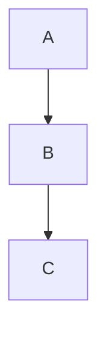

# Documentation Viewer

aide-frame enthält ein integriertes Dokumentations- und Help-System mit Web-UI.

## Übersicht

- `/about` - Projekt-Dokumentation (aus `docs/` Verzeichnis)
- `/help` - User-Help (aus `help/` Verzeichnis)

Beide nutzen das gleiche unified viewer Template mit:
- Dynamische Sidebar-Navigation
- Markdown-Rendering (marked.js)
- Mermaid-Diagramm-Support
- Table of Contents
- Breadcrumb-Navigation

## Architektur

```
┌─────────────────────────────────────────────────────────────┐
│  Browser                                                     │
│  ┌─────────────────────────────────────────────────────────┐│
│  │  viewer.html (unified template)                          ││
│  │  - Mode aus URL: /help → help, /about → docs            ││
│  │  - Unified API: /api/viewer/structure?root={mode}       ││
│  │  - Unified API: /api/viewer/content?root={mode}&path=   ││
│  └─────────────────────────────────────────────────────────┘│
└─────────────────────────────────────────────────────────────┘
                              │
                              ▼
┌─────────────────────────────────────────────────────────────┐
│  aide_frame/http_routes.py                                   │
│  ├── handle_request()      → Route-Handling                  │
│  ├── /api/viewer/structure → get_docs_structure()           │
│  ├── /api/viewer/content   → load_file()                    │
│  ├── /api/app/config       → App-Konfiguration              │
│  └── /static/frame/*       → aide-frame Assets              │
└─────────────────────────────────────────────────────────────┘
                              │
                              ▼
┌─────────────────────────────────────────────────────────────┐
│  aide_frame/docs_viewer.py                                   │
│  ├── get_docs_structure()  → Sections mit Titeln            │
│  ├── get_structure()       → Flache Dateiliste              │
│  ├── load_file()           → Markdown-Inhalt laden          │
│  └── extract_title_and_description() → Metadaten parsen     │
└─────────────────────────────────────────────────────────────┘
                              │
                              ▼
┌─────────────────────────────────────────────────────────────┐
│  app/docs/                  │  app/help/                     │
│  ├── index.md               │  ├── index.md                  │
│  ├── requirements/          │  ├── getting-started.md        │
│  ├── platform/              │  └── faq.md                    │
│  ├── implementation/        │                                │
│  ├── deployment/            │                                │
│  └── development/           │                                │
└─────────────────────────────────────────────────────────────┘
```

## Unified Viewer API

Eine einheitliche API für beide Modi (docs und help):

| Endpoint | Beschreibung |
|----------|-------------|
| `/api/viewer/structure?root=docs` | Docs-Struktur (mit Sections) |
| `/api/viewer/structure?root=help` | Help-Struktur (flach) |
| `/api/viewer/content?root=docs&path=file.md` | Docs-Inhalt |
| `/api/viewer/content?root=help&path=file.md` | Help-Inhalt |
| `/api/app/config` | App-Name, Back-Link, Features |

### Beispiel: Structure

```bash
curl "http://localhost:8080/api/viewer/structure?root=docs"
```

```json
{
  "sections": [
    {
      "name": "Overview",
      "docs": [
        {
          "path": "index.md",
          "title": "Projekt Name",
          "description": "Kurzbeschreibung."
        }
      ]
    }
  ]
}
```

### Beispiel: Content

```bash
curl "http://localhost:8080/api/viewer/content?root=help&path=index.md"
```

```json
{
  "content": "# Help\n\nMarkdown content...",
  "path": "index.md",
  "framework": false
}
```

## Docs vs Help

| Aspekt | Docs (`/about`) | Help (`/help`) |
|--------|-----------------|----------------|
| Zweck | Technische Dokumentation | User-Anleitung |
| Struktur | Hierarchisch mit Sections | Flach |
| Verzeichnis | `app/docs/` | `app/help/` |
| Auto-Discovery | Nach Unterverzeichnissen | Alle .md Dateien |

## Section-Erkennung (Docs)

Docs-Sections werden automatisch aus Unterverzeichnissen erkannt:

```
docs/
├── index.md              → Section "Overview"
├── requirements/         → Section "Requirements"
│   └── index.md
├── platform/             → Section "Platform"
│   └── index.md
└── implementation/       → Section "Implementation"
    └── index.md
```

Standard-Reihenfolge:
1. Overview (index.md im Root)
2. Requirements
3. Platform
4. Implementation
5. Deployment
6. Development

## Title und Description

Aus jeder Markdown-Datei werden extrahiert:

```markdown
# Mein Titel

Dies ist die Beschreibung (erster Satz).

Weitere Absätze...
```

- **Title**: Erste `# Heading`
- **Description**: Erster vollständiger Satz nach dem Titel

## Web-UI Features

### Sidebar
- Auto-generiert aus API
- Hover-Tooltips mit Beschreibungen
- Active-Link-Highlighting
- Mobile-Toggle

### Table of Contents
- Auto-generiert aus Headings
- Collapsible
- Smooth-Scrolling

### Markdown-Support
- GitHub-Flavored Markdown
- Tabellen, Code-Blöcke, Task-Listen
- Syntax-Highlighting

### Mermaid-Diagramme

````markdown

````

Lädt von CDN, funktioniert auch offline wenn lokal verfügbar.

### Navigation

- **Deep-Links**: `/about?doc=implementation/index.md`
- **Breadcrumbs**: Zeigt aktuelle Position
- **Link-Interception**: `.md` Links laden via JavaScript

## Assets

Bilder in docs/help werden über spezielle Asset-Routen geladen:

```markdown

```

Wird automatisch umgeschrieben zu:
- `/docs-assets/architecture.png` (für docs)
- `/help-assets/architecture.png` (für help)

## Sicherheit

Path-Traversal-Schutz:
- `..` in Pfaden wird blockiert
- Pfade werden auf das jeweilige Verzeichnis beschränkt

## Dateien in aide-frame

| Datei | Zweck |
|-------|-------|
| `http_routes.py` | Route-Handler für /about, /help, APIs |
| `docs_viewer.py` | Struktur-Parsing, Datei-Laden |
| `static/templates/viewer.html` | Unified Web-UI Template |
| `static/css/base.css` | Basis-CSS für Apps |
| `static/css/docs-viewer.css` | Viewer-spezifisches CSS |
| `static/js/marked.min.js` | Markdown-Parser |

## Legacy APIs (Kompatibilität)

Die alten APIs werden weiterhin unterstützt:

| Legacy | Neu |
|--------|-----|
| `/api/docs/structure` | `/api/viewer/structure?root=docs` |
| `/api/docs/{path}` | `/api/viewer/content?root=docs&path={path}` |
| `/api/help/structure` | `/api/viewer/structure?root=help` |
| `/api/help/{path}` | `/api/viewer/content?root=help&path={path}` |

## Siehe auch

- [HTTP Routes](http-routes.md) - DocsConfig und API-Details
- [Getting Started](getting-started.md) - Neue App erstellen
