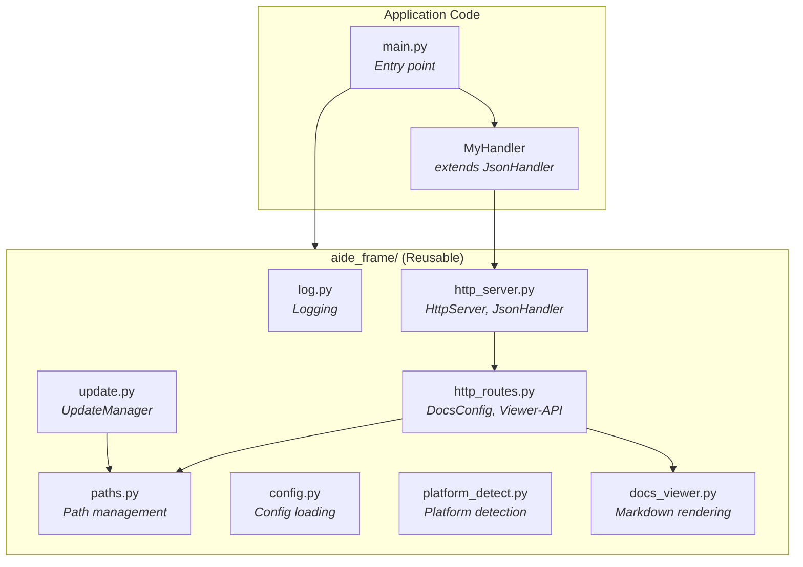

# AIDE Frame

Reusable application framework for Raspberry Pi projects.

AIDE Frame provides common infrastructure that can be used as a starting point for new Python applications:

- **Logging** - Centralized, configurable logging with systemd-friendly output
- **Path Management** - Base paths with extensible registration for app-specific paths
- **Configuration** - JSON config loading with deep merge and defaults support
- **Platform Detection** - Automatic detection of Raspberry Pi, WSL2, Linux desktop, etc.
- **Remote Updates** - GitHub-based update system with rollback support

## Documentation

| Document | Description |
|----------|-------------|
| [Getting Started](getting-started.md) | Neue App erstellen, kanonische Initialisierung |
| [HTTP Server](http-server.md) | HttpServer und JsonHandler für Web-Apps |
| [HTTP Routes](http-routes.md) | DocsConfig und Viewer-API |
| [Update-Routen](update-routes.md) | Remote-Update UI und API |
| [Widgets](widgets.md) | JavaScript-Widgets (Header, Status) |
| [Docs Viewer](docs-viewer.md) | Markdown-Rendering für Docs und Help |
| [Architecture](architecture.md) | Framework/Anwendung-Trennung, Build- und Release-Prozess |
| [Logging](logging.md) | Logger-Konfiguration und Nutzung |
| [Paths](paths.md) | Pfad-Management und Registrierung |
| [Config](config.md) | Konfigurationsdateien laden und mergen |
| [Platform Detection](platform-detect.md) | Plattform-Erkennung (Raspi, WSL, etc.) |
| [Remote Updates](update.md) | GitHub-basiertes Update-System |

## Module Overview



## Dependency Rules

- `aide_frame/` modules are self-contained and reusable across projects
- Application code depends on `aide_frame/`, never the reverse
- The main entry point is the composition root - it wires everything together

## Quick Start

```python
#!/usr/bin/env python3
import os
import sys

# 1. PATH SETUP
SCRIPT_DIR = os.path.dirname(os.path.abspath(__file__))
PROJECT_DIR = os.path.dirname(SCRIPT_DIR)
AIDE_FRAME_PATH = os.path.join(PROJECT_DIR, 'aide-frame', 'python')
if os.path.isdir(AIDE_FRAME_PATH) and AIDE_FRAME_PATH not in sys.path:
    sys.path.insert(0, AIDE_FRAME_PATH)

# 2. AIDE-FRAME INIT
from aide_frame import paths
paths.init(SCRIPT_DIR)

# 3. AIDE-FRAME IMPORTS
from aide_frame import http_routes, http_server, update_routes
from aide_frame.log import set_level


class MyHandler(http_server.JsonHandler):
    def get(self, path, params):
        if path == '/':
            return self.file('index.html')
        if path == '/api/hello':
            return {'message': 'Hello, World!'}
        return {'error': 'Not found'}, 404


def main():
    set_level('INFO')
    server = http_server.HttpServer(
        port=8080,
        handler_class=MyHandler,
        app_dir=SCRIPT_DIR,
        docs_config=http_routes.DocsConfig(app_name="My App"),
        update_config=update_routes.UpdateConfig(
            github_repo="username/myapp",
            service_name="myapp"
        ),
    )
    server.run()


if __name__ == '__main__':
    main()
```

Siehe [Getting Started](getting-started.md) für eine vollständige Anleitung.

